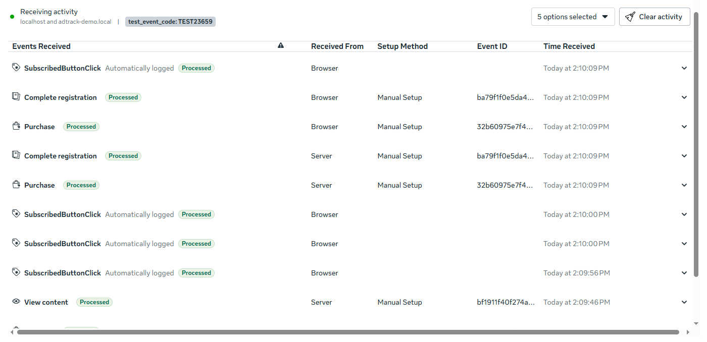

# adtrack-demo

Server-side conversion tracking for Meta, built so that lost events are
**visible** instead of silent.

Quiz landing page → collector → durable queue → Conversions API → reconciliation.

Every tracking system reports success. This one can prove it.

---

## The problem it solves

A conversion can be lost with no error anywhere:

- The collector returns **200** to the browser.
- Meta returns **200** to the worker.
- Nothing is logged as an error.
- The event never reaches the ad platform.

Nothing in Events Manager says *"you lost 3 purchases today."* Meta doesn't know
about events it didn't receive. The gap surfaces weeks later — as a discrepancy
between Stripe and Ads Manager, if anyone reconciles them at all.

Meanwhile the optimiser has been bidding against a number that is wrong.

---

## What it demonstrates

### Deduplication between Pixel and CAPI

`event_id` is generated once in the browser and sent to both destinations. Meta
counts one conversion, not two.



*Same `event_id`, received from Browser and from Server. One conversion.*

### Why server-side tracking exists

In the same screenshot: `View content` arrived from the **Server only** — the
browser copy never fired.

This was not staged. It happened on the first run. Ad blocker, slow pixel, ITP,
cookie policy — the cause doesn't matter. The conversion survived anyway.

### Losses are caught, named, and priced

```
  accepted by collector    6
  confirmed by Meta        5
  ─────────────────────────
  gap                      1

  pending 0   delivered 5   failed 1

  ⚠ 1 event(s) unconfirmed — $199.00 of Purchase value Meta never saw

  event_id                           event      status   tries  last error
  ─────────────────────────────────────────────────────────────────────────
  888b68679fb641c5a7e91f5a996349a7   Purchase   failed   5      Invalid parameter
```

Every layer reported success. A $199 conversion never arrived.
`reconcile.py` is the only thing in the stack that knows.

---

## Seven things learned building it

1. **A token in the query string leaks into your logs.** `httpx` logs full
   request URLs at INFO. The token belongs in the request body.

2. **`fbp`, `fbc`, IP and user-agent must NOT be hashed.** Hashing them doesn't
   protect the user — it destroys the match. The most common error in
   hand-rolled CAPI integrations, and it looks like extra diligence.

3. **HTTP 200 with `events_received: 0` is a silent drop.** The request
   succeeded; the event did not. Checking only the status code reports this as
   success.

4. **4xx and 5xx are not the same failure.** Retrying a malformed payload five
   times buries the real cause under five identical errors. Retrying a Meta
   outage is exactly what the queue is for.

5. **An empty-string identifier is worse than an absent one.** `{"em": ""}`
   tells Meta an identifier is present and worthless. Match quality drops.

6. **Hash the normalised value, not the raw one.** `+380 (67) 123-45-67` and
   `380671234567` must produce the same hash, or one user becomes two.

7. **Meta's Test Events tab doesn't exist until the first event arrives.** Which
   makes bootstrap circular: you need the test code to test, and the tab that
   gives you the code only appears after you've already sent something live.

Full reasoning, every architectural trade-off, and every trap hit along the way:
**[NOTES.md](NOTES.md)**

---

## Run it

```bash
python3.12 -m venv .venv && source .venv/bin/activate
pip install -r requirements.txt

pytest evals/ -v
```

15 tests, ~1 second, **no network and no credentials required**. The suite mocks
Meta's transport entirely — it is green on a machine that has never seen an
access token, because a suite that needs live API access is a suite that gets
skipped, and a skipped test protects nothing.

### Against a real Meta dataset

```bash
cp .env.example .env
```

Fill in `META_PIXEL_ID` and `META_ACCESS_TOKEN` from Events Manager
(Datasets → your dataset → Settings → Conversions API).

Leave `META_TEST_EVENT_CODE` empty for now — Meta's **Test events** tab does not
exist until the dataset has received its first event, so the bootstrap is
circular. Send one event live, then collect the code:

```bash
python tools/send_test_event.py --event Purchase
```

The **Test events** tab now appears. Copy the code (`TEST12345`) into
`META_TEST_EVENT_CODE`. Every subsequent event is flagged as a test.

> If `send_test_event.py` prints `mode: LIVE` after you've set the code, check
> for a stale exported shell variable — pydantic-settings gives environment
> variables priority over `.env`, and an empty export shadows the file silently.
> `unset META_TEST_EVENT_CODE` fixes it.

### The end-to-end demo

```bash
uvicorn app.main:app --host 0.0.0.0 --port 8100
```

Open **http://localhost:8100** and keep the **Test events** tab open in Events
Manager alongside it.

Complete the quiz. Each step fires the same event twice — once from the Pixel in
the browser, once from the server via the Conversions API — carrying the same
`event_id`.

In Test events you will see each event arrive **from both Browser and Server**,
sharing one `event_id`. That is deduplication working: Meta counts one
conversion, not two.

### The tools

```bash
python tools/send_test_event.py --event Purchase          # send one event
python tools/send_test_event.py --event Purchase --no-pii # watch match quality drop
python tools/send_test_event.py --event-id fixed-1        # run twice: dedup
python tools/reconcile.py --verbose                       # audit the gap
python tools/reconcile.py --exit-code                     # non-zero on gap; for cron
```

---

## Stack

Python 3.12 · FastAPI · httpx · SQLite (WAL) · pytest · Meta Conversions API

---

## What this is not

Not batched, not multi-platform, not a GTM replacement, not production-hardened.
SQLite is the queue; at real volume that becomes Postgres and the worker becomes
its own process — the queue is the interface, so that migration touches nothing
else.

The point was never to ship a tracking platform. It was to show that the hard
part of tracking isn't sending the event. It's knowing, provably, whether it
arrived.
